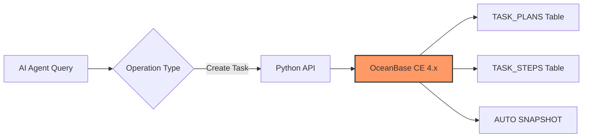
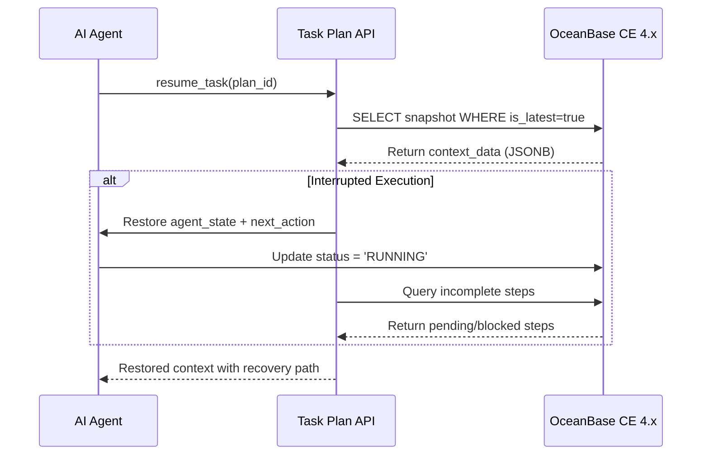

# memory-ob4-ce-by-yhw v0.1.2 Multi-Agent Architecture Edition

[GitHub Repository](https://github.com/Haiwen-Yin/memory-ob4-ce-by-yhw) · [SKILL.md](SKILL.md) · [RELEASE_NOTES_v0.1.2.md](RELEASE_NOTES_v0.1.2.md)

AI Agent Memory System with OceanBase CE 4.x + Property Graph via Recursive CTEs + Multi-Agent Architecture Support

**Version**: v0.1.2  
**Author**: Haiwen Yin (胖头鱼 🐟) - Database Expert  
**Date**: 2026-05-07 CST  
**License**: Apache License 2.0

---

## 🎯 **Executive Summary**

This is the **v0.1.2 Multi-Agent Architecture Edition** - an upgrade from v0.1.1 that introduces critical AI Agent capabilities:
- ✅ **Task Plan Persistence** - Durable task tracking across sessions
- ✅ **Breakpoint Recovery** - Resume exactly where interrupted after failures
- ✅ **Historical Learning** - Learn from past task patterns and outcomes
- ✅ **Multi-Agent Architecture** - Complete framework for managing multiple coordinated AI agents
- ✅ **Agent Registry System** - Centralized agent lifecycle management
- ✅ **Memory Access Control** - Fine-grained visibility policies per agent
- ✅ **Collaboration Framework** - Built-in communication channels for agent-to-agent coordination

---

## 📊 v0.1.1 vs v0.1.2 Feature Comparison

| Feature | v0.1.1 | **v0.1.2** | Description ||
|--|--------|------------|-------------||
|| OceanBase CE 4.x Support | ✅ | ✅ | Core platform support ||
|| Property Graph via CTEs | ✅ | ✅ | Recursive query capabilities ||
|| Vector Similarity Search | ✅ | ✅ | Application-layer similarity ||
|| Full-Text Search | ✅ | ✅ | Native text indexing ||
|| Task Plan Storage | ❌ | ✅ | **NEW**: Complete task tracking system ||
|| Breakpoint Recovery | ❌ | ✅ | **NEW**: Resume after failures ||
|| Historical Learning | ❌ | ✅ | **NEW**: Pattern recognition ||
|| Multi-Agent Architecture | ❌ | ✅ | **NEW**: Complete framework ||
|| Agent Registry System | ❌ | ✅ | **NEW**: Centralized management ||
|| Memory Access Control | ❌ | ✅ | **NEW**: Fine-grained policies ||
|| Collaboration Channels | ❌ | ✅ | **NEW**: Built-in communication ||

---

## 🆕 v0.1.2 New: Multi-Agent Architecture

### Overview

The Multi-Agent Architecture provides a structured framework for managing multiple AI agents with centralized memory access control, session management, and collaboration capabilities on OceanBase CE 4.x.

This edition introduces four new components:
- **Agent Registry (agent_registry)** - Centralized agent lifecycle management
- **Memory Access Control (agent_memory_access)** - Fine-grained visibility policies  
- **Collaboration Framework (agent_collaboration)** - Agent-to-agent communication channels
- **Session Management (agent_session)** - Active session tracking and monitoring

### Architecture Diagram (Multi-Agent System)

```
┌─────────────────────────────────────────────────────────────┐
│                    Multi-Agent Memory System                │
│                      v0.1.2 Edition                         │
├─────────────────────────────────────────────────────────────┤
│                                                             │
│  ┌───────────┐    ┌───────────┐    ┌───────────┐            │
│  │ Agent A   │    │ Agent B   │    │ Agent C   │            │
│  │ (Analyzer)│    │(Writer)   │    │(Deployer) │            │
│  └─────┬─────┘    └─────┬─────┘    └─────┬─────┘            │
│        │                │                │                  │
│        ▼                ▼                ▼                  │
│  ┌───────────────────────────────────────────────────────┐  │
│  │              AGENT_REGISTRY (Central)                 │  │
│  │  • Registration & Lifecycle                           │  │
│  │  • Capability Discovery                               │  │
│  │  • Health Monitoring                                  │  │
│  └───────────────────────┬───────────────────────────────┘  │
│                          │                                  │
│  ┌───────────────────────▼───────┐                          │
│  │    AGENT_MEMORY_ACCESS        │                          │
│  │  • Visibility Policies        │                          │
│  │  • Data Access Control        │                          │
│  └───────────────────────────────┘                          │
│                          │                                  │
│  ┌───────────────────────▼───────┐                          │
│  │    AGENT_COLLABORATION        │                          │
│  │  • Communication Channels     │                          │
│  │  • Cross-Agent Sharing        │                          │
│  └───────────────────────────────┘                          │
│                          │                                  │
│  ┌───────────────────────▼───────┐                          │
│  │    AGENT_SESSION              │                          │
│  │  • Session Tracking           │                          │
│  │  • State Management           │                          │
│  └───────────────────────────────┘                          │
│                          │                                  │
│  ┌───────────────────────▼───────┐                          │
│  │       MEMORIES TABLE          │                          │
│  │    (Memory Storage Layer)     │                          │
│  └───────────────────────────────┘                          │
│                                                             │
│    Benefits:                                                │
│    ✅ Centralized Agent Management	                      │
│    ✅ Fine-Grained Memory Access Control	                  │
│    ✅ Built-in Collaboration Framework	                  │
│    ✅ Session State Persistence	                          │
│    ✅ Multi-Agent Scalability	                              │
│                                                             │
└─────────────────────────────────────────────────────────────┘
```

### Quick Start (Multi-Agent)

```bash
# 1. Deploy Multi-Agent schema (NEW in v0.1.2)
psql -U postgres -d memory_graph -f scripts/init_multi_agent_schema.sql

# 2. Import Python API
from scripts.agent_api import create_agent, get_active_agents, create_session

# 3. Register an agent
agent = create_agent(
    agent_name="analysis-agent",
    agent_type="analytical",
    capabilities={"sql_query": True, "data_analysis": True}
)
print(f"Registered agent: {agent['agent_id']}")

# 4. Create a session
session = create_session(agent_id=agent['agent_id'])
print(f"Created session: {session['session_id']}")

# 5. List active agents
agents = get_active_agents()
for agent in agents:
    print(f"- {agent['agent_name']} ({agent['status']})")
```

### Python API Functions (Multi-Agent)

#### AgentRegistryAPI - Agent Lifecycle Management

```python
from scripts.agent_api import AgentRegistryAPI

registry = AgentRegistryAPI(conn_params={'host': 'localhost', 'database': 'memory_graph'})

# Register new agent
agent = registry.register_agent(
    agent_name="writing-agent",
    agent_type="content",
    capabilities={"text_generation": True, "editing": True},
    status="ACTIVE"
)

# Get agent details
agent_info = registry.get_agent(agent_id=1)

# List active agents
active_agents = registry.list_active_agents()
```

#### MemoryVisibilityAPI - Access Control

```python
from scripts.agent_api import MemoryVisibilityAPI

access_api = MemoryVisibilityAPI(conn_params={'host': 'localhost', 'database': 'memory_graph'})

# Set collaborative access (shared among specific agents)
access_api.set_access_policy(
    agent_id=1,
    memory_scope="COLLABORATIVE",
    accessible_to=[2, 3],  # Agents 2 and 3 can access
    can_read=True,
    can_write=False
)

# Get current policy
policy = access_api.get_access_policy(agent_id=1)
```

#### AgentSessionAPI - Session Management

```python
from scripts.agent_api import AgentSessionAPI

session_api = AgentSessionAPI(conn_params={'host': 'localhost', 'database': 'memory_graph'})

# Create session for agent execution
session = session_api.create_session(
    agent_id=1,
    task_plan_id=42  # Optional: link to a task plan
)

# Get all active sessions
active_sessions = session_api.get_active_sessions()

# End session when done
session_api.end_session(session['session_id'])
```

#### CollaborationAPI - Agent Communication

```python
from scripts.agent_api import CollaborationAPI

collab_api = CollaborationAPI(conn_params={'host': 'localhost', 'database': 'memory_graph'})

# Send collaboration request to another agent
request = collab_api.send_collaboration_message(
    source_agent_id=1,  # analysis-agent
    target_agent_id=2,  # writing-agent
    collab_type="REQUEST",
    message="Please generate documentation for this query result"
)

# Update request status when complete
collab_api.update_collaboration_status(request['collab_id'], "COMPLETED")

# Get all pending requests
pending = collab_api.get_pending_requests()
```

---

## 📋 **Quick Start**

### Prerequisites

1. **OceanBase CE 4.x** (Required)
   - Must support recursive CTEs and JSON operations
   - Download from [OceanBase](https://www.oceanbase.com/)

2. **Python 3.8+** (Required for Task Plan API)
   ```bash
   python3 --version
   pip install psycopg2-binary
   ```

---

## 🚀 **Installation**

### Step 1: Install OceanBase CE 4.x

For Ubuntu/Debian systems:
```bash
# Download and install OceanBase CE (example for v4.5.0)
wget https://github.com/oceanbase/oceanbase/releases/download/v4.5.0/OceanBase-ce-4.5.0-rhel7-x86_64.tar.gz
tar -xzf OceanBase-ce-4.5.0-rhel7-x86_64.tar.gz
cd oceanbase && ./install.sh

# Initialize and start cluster
obd cluster start memorycluster --force
```

### Step 2: Create Database and Schema

Create the database if it doesn't exist:
```bash
mysql -h 127.0.0.1 -P 2881 -u root@mem --password=your_password
CREATE DATABASE memory_graph;
USE memory_graph;
```

Deploy all schema components:
```bash
# Original memory system (v0.1.1)
mysql -h 127.0.0.1 -P 2881 -u root@mem --password=your_password memory_graph < scripts/schema_loader.py

# Task plan persistence (NEW v0.1.2)
mysql -h 127.0.0.1 -P 2881 -u root@mem --password=your_password memory_graph < scripts/init_task_plan_system.sql

# Multi-Agent Architecture (NEW v0.1.2)
mysql -h 127.0.0.1 -P 2881 -u root@mem --password=your_password memory_graph < scripts/init_multi_agent_schema.sql
```

### Step 3: Use Python API for Task Management

```python
from scripts.task_plan_api import create_task_plan, resume_task

# Create task with auto-snapshot on creation
plan = create_task_plan(
    plan_name="Deploy Production Database",
    plan_type="deployment",
    description="Execute zero-downtime migration with rollback capability",
    goal={
        "objective": "Migrate schema changes safely without downtime",
        "risk_level": "high",
        "rollback_required": True,
        "estimated_duration_minutes": 45
    },
    steps=[
        {"order": 1, "name": "Backup current state"},
        {"order": 2, "name": "Execute migration script"},
        {"order": 3, "name": "Run validation queries"},
        {"order": 4, "name": "Update documentation"}
    ]
)

print(f"Created task: {plan['plan_id']} - {plan['plan_name']}")

# If agent was interrupted and needs to resume
context = resume_task(plan_id=plan['plan_id'])
if context.get('incomplete_steps'):
    print(f"Resuming from step: {context['next_action']}")
```

---

## 📊 **System Architecture Overview**

### Component Layers

| Layer | Component | Description |
|-------|-----------|-------------|
| **Application** | AI Agents | All AI agents using memory system via Python API |
| **Interface** | Task Plan API | OceanBase connection layer for all operations |
| **Storage** | JSONB Tables | Structured storage with native indexing |
| **Graph** | Property Graph | Recursive CTE-based graph traversal |

### Data Flow Architecture

#### Write Operations (Task Creation)



#### Breakpoint Recovery Flow



---

## 🗄️ **Database Schema**

### Original Memory System Tables (v0.1.1 - Unchanged)

```sql
-- Memory nodes (vertices for Property Graph)
CREATE TABLE memory_nodes (
    node_id      SERIAL PRIMARY KEY,
    label        VARCHAR(100),
    node_type    VARCHAR(50),
    properties   JSONB,           -- Properties stored as JSONB
    embedding    TEXT             -- BGE-M3 embedding as text string
);

-- Memory edges (edges for Property Graph)  
CREATE TABLE memory_edges (
    edge_id      SERIAL PRIMARY KEY,
    source_node  INTEGER REFERENCES memory_nodes(node_id),
    target_node  INTEGER REFERENCES memory_nodes(node_id),
    edge_type    VARCHAR(100),
    properties   JSONB            -- Properties stored as JSONB
);

-- Core memories table
CREATE TABLE memories (
    id           SERIAL PRIMARY KEY,
    content      TEXT,
    memory_type  VARCHAR(100),
    category     VARCHAR(100),
    priority     INTEGER,
    created_at   TIMESTAMP DEFAULT CURRENT_TIMESTAMP,
    updated_at   TIMESTAMP,
    expires_at   TIMESTAMP,
    tags         JSONB,           -- Array of tags as JSONB
    metadata     JSONB            -- Metadata object as JSONB
);

-- Vector embeddings for memories
CREATE TABLE memories_vectors (
    id            SERIAL PRIMARY KEY,
    memory_id     INTEGER NOT NULL REFERENCES memories(id) ON DELETE CASCADE,
    embedding     TEXT,
    created_at    TIMESTAMP DEFAULT CURRENT_TIMESTAMP,
    model_version VARCHAR(50) DEFAULT 'bge-m3'
);
```

### v0.1.2 New: Multi-Agent System Tables

```sql
-- See scripts/init_multi_agent_schema.sql for complete DDL
-- Key tables: agent_registry, agent_memory_access, agent_collaboration, agent_session
```

---

## 🔧 **API Functions (Python Integration)**

### create_task_plan() - Create task plan and automatically save initial context snapshot

```python
def create_task_plan(plan_name, plan_type="task", description="", goal=None, steps=None):
    """
    Create a new task plan and automatically save initial context
    
    Args:
        plan_name (str): Task name
        plan_type (str): task/deployment/research/analysis  
        description (str): Task description
        goal (dict): Final goal (structured)
        steps (list[dict]): Step list [{order, name, action}, ...]
    
    Returns:
        dict: Created plan information
    """
```

### resume_task() - Resume task execution from breakpoint (core feature)

```python  
def resume_task(plan_id):
    """
    Resume task execution from breakpoint
    
    Args:
        plan_id (int): Plan ID
    
    Returns:
        dict: Restored context information including next_action, incomplete_steps
    """
    # 1. Get latest snapshot (is_latest = true)
    # 2. Restore agent_state and conversation_history from context_data
    # 3. Identify incomplete steps by checking step status  
    # 4. Resume execution with next_action as starting point
```

### search_completed_tasks() - Search completed tasks for learning and pattern reuse

```python
def search_completed_tasks(query_params=None):
    """
    Search completed tasks for learning and pattern reuse
    
    Args:
        query_params (dict): {type, status, tags, keywords, date_range}
    
    Returns:
        list[dict]: Matching task list with success metrics and statistics
    """
```

---

## 📚 **Documentation**

- [SKILL.md](./SKILL.md) - Skill definition and usage guide (v0.1.2 Multi-Agent Edition)
- [README.md](./README.md) - This file (project documentation v0.1.2)
- [CHANGELOG.md](./CHANGELOG.md) - Complete version history and changes (v0.1.0 through v0.1.2)
- [RELEASE_NOTES_v0.1.2.md](./RELEASE_NOTES_v0.1.2.md) - Detailed release notes for v0.1.2

---

## 👨‍💻 **Author & Maintainer**

**Haiwen Yin (胖头鱼 🐟)**  
Oracle/PostgreSQL/MySQL ACE Database Expert

- **Blog**: https://blog.csdn.net/yhw1809
- **GitHub**: https://github.com/Haiwen-Yin

---

## 📄 **License**

This project is licensed under the Apache License, Version 2.0 - see the [LICENSE](LICENSE) file for details.
